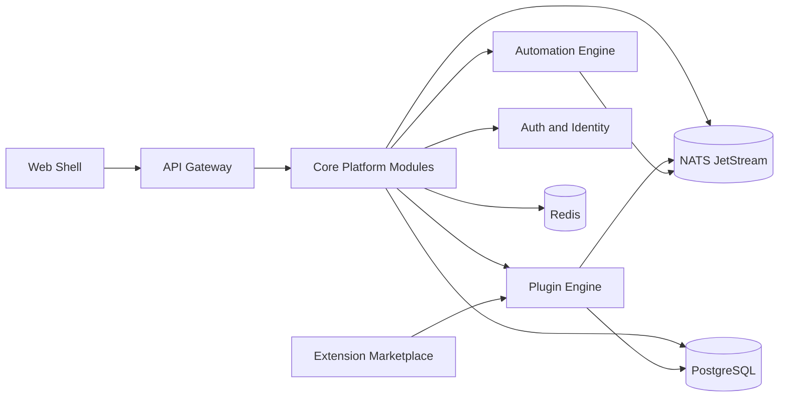

# BizForge Implementation Blueprint

## 1. Complete System Architecture Diagram

## 2. Backend Service Architecture

- Core API uses a modular monolith with separable domains.
- Current modules: plugin-engine, event-bus, automation-engine, transport routes.
- Planned extractable services: marketplace, workflow executor, messaging adapter, analytics ingest.

## 3. Plugin System Architecture

- Plugin package includes plugin.json, backend entry, frontend entry, migrations.
- Plugin lifecycle: install -> validate -> enable -> disable -> uninstall.
- Plugin permissions gate contacts, calendar, messages, payments, automation, analytics, documents.

## 4. API Design

- REST endpoints under /api for control and resources.
- Plugin metadata endpoints under /api/plugins/:name/meta.
- Automation endpoints under /api/automation/rules.

## 5. Database Schema Design

- Core schema in infra/db/001_core_schema.sql.
- Plugin schemas in plugin-specific migration folders.

## 6. Event Bus Design

- In-memory implementation for bootstrap.
- NATS JetStream target for production.
- Envelope and topic taxonomy in infra/events/event-catalog.md.

## 7. Automation Engine Design

- Trigger-based rule store.
- Condition matcher over event payload.
- Action dispatch via automation.action.requested event.

## 8. Plugin SDK Design

- Shared contracts in packages/plugin-sdk/src/index.ts.
- Types include manifest, registration, routes, triggers, actions, and event envelope.

## 9. Project Folder Structure

- apps/core-api: platform backend and runtime
- apps/web: dashboard shell
- packages/plugin-sdk: extension contracts
- plugins/appointment-manager: reference plugin
- infra/db: SQL migrations
- infra/events: event catalog

## 10. Example Plugin Implementation

- Appointment Manager plugin demonstrates manifest, routes, trigger, action, migration, and UI component.

## 11. Deployment Architecture

- Phase 1 deploy as modular monolith plus Redis/NATS/PostgreSQL.
- Use containers with separate core-api and web services.

## 12. Future Scalability Plan

- Phase 1: modular monolith in one service domain.
- Phase 2: extract workflow executor and messaging into microservices.
- Phase 3: full distributed event-driven architecture with dedicated consumer groups per domain.
